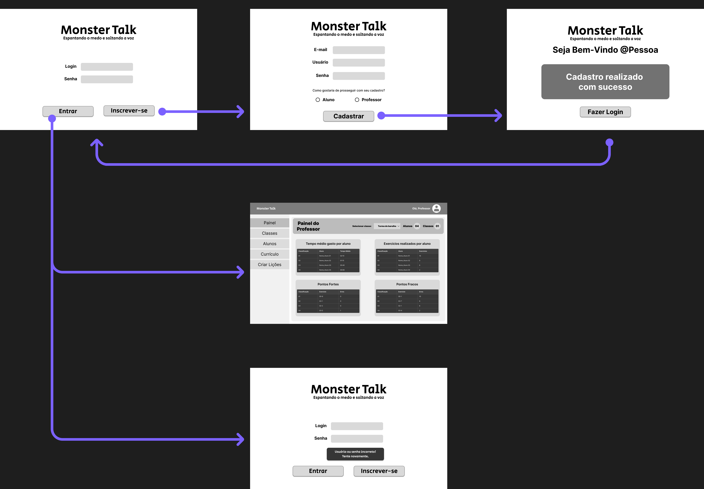

# Projeto de Interface  
**Visão geral da interação do usuário nas telas do MonsterTalk**

## User Flow

### Login e Cadastro  
Fluxo inicial para login do usuário, com exibição de mensagens de erro em caso de falha e redirecionamento em caso de sucesso. Também inclui o painel de criação de um novo usuário, solicitando e-mail, nome de usuário, senha e a indicação de sua função no sistema (aluno ou professor).

---

### Perfil de Usuário  
Ao clicar no ícone do avatar, o usuário acessa a área de gerenciamento do perfil. Nessa tela, ele pode atualizar seu nome, senha ou até mesmo excluir sua conta, caso deseje.

---

### Painel do Professor – Início  
O painel inicial do professor apresenta uma visão geral com indicadores como o número de turmas, número total de alunos e um seletor para escolher qual turma visualizar. Abaixo, são exibidas tabelas com dados como tempo médio de estudo por aluno, número de exercícios realizados, pontos fortes (questões com menos erros) e pontos fracos (questões com mais erros).

---

### Painel do Professor – Classes  
Tela destinada à administração de turmas. O professor pode criar, editar ou excluir turmas conforme necessário.

---

### Painel do Professor – Alunos  
Neste painel, o professor pode gerenciar os alunos de suas turmas, incluindo ações como criar novos alunos, editar a turma à qual pertencem ou excluir um aluno específico.

---

### Painel do Professor – Currículo  
O painel de currículo permite ao professor visualizar todo o conteúdo disponível na plataforma, incluindo materiais pré-existentes e aqueles criados por ele mesmo.

---

### Painel do Professor – Criar Lições  
Neste espaço, o professor pode criar e personalizar suas próprias lições. É possível definir o nível de dificuldade, editar conteúdos existentes ou excluir atividades que não sejam mais necessárias.

---

### Painel do Aluno – MonsterHub  
O MonsterHub é o painel principal do aluno. Nele, são apresentadas atividades organizadas por nível, o ponto de parada da última sessão, dicas personalizadas e conteúdos complementares. Ao selecionar uma atividade, o aluno é direcionado para uma dinâmica interativa de múltipla escolha, com o objetivo de conhecer e fixar o conteúdo.

---

### Painel do Aluno – Classe  
Caso o aluno esteja vinculado a uma turma, esta tela exibe todas as lições disponibilizadas pelo professor. O aluno pode acessar diretamente o conteúdo e, se desejar, pode sair da turma clicando em **"Sair da classe"**, sendo necessário confirmar a ação em seguida.

---

### Painel do Aluno – Meu Progresso  
Tela dedicada ao acompanhamento do desempenho do aluno. Apresenta palavras aprendidas, lições concluídas, percentual de progresso nas aulas e um histórico de atividades recentes para acesso rápido.

---

### Painel do Fórum – Comunidade  
O painel do fórum é o espaço de interação entre alunos e professores. Nele, é possível compartilhar experiências, tirar dúvidas, criar publicações e interagir com comentários.

