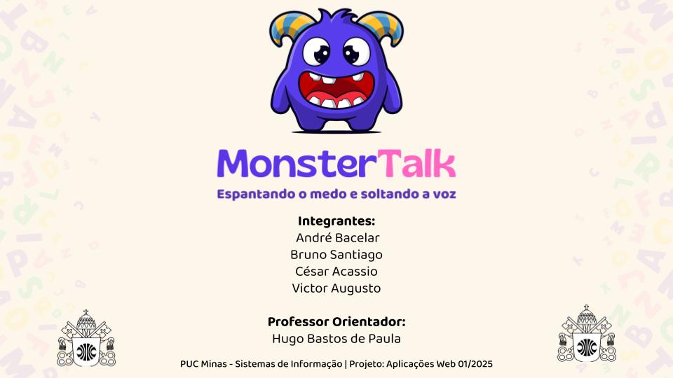

# Apresentação
## Resumo do Processo de Desenvolvimento

O desenvolvimento do **MonsterTalk** foi uma jornada completa de criação de uma aplicação web interativa, desde a concepção até a implementação e o deploy. O processo seguiu as seguintes etapas:

1.  **Especificação:** Iniciámos com a definição de personas detalhadas — a aluna **Amanda**, que procura uma forma de aprendizagem divertida, e a professora **Camila**, que necessita de ferramentas de gestão eficazes. Com base nestas personas, elaborámos histórias de utilizador e definimos os requisitos funcionais e não funcionais que nortearam todo o projeto.

2.  **Desenvolvimento e Arquitetura:** O projeto foi construído utilizando tecnologias de frontend (HTML5, CSS3, JavaScript ES6) e uma API simulada com `json-server`.
   
3.  **Implementação de Funcionalidades:** Desenvolvemos dois painéis completos e distintos:
    * **Painel do Aluno:** Com um dashboard, lições interativas, atividades de "Palavra do Dia" e "Leitor de Notícias", e uma secção para revisão de vocabulário.
    * **Painel do Professor:** Com um dashboard de métricas avançadas, gestão completa de turmas e ferramentas para a criação de lições e conteúdos personalizados.

4.  **Testes e Validação:** Foram elaborados e executados planos de testes de software e usabilidade para garantir a qualidade, a funcionalidade e a facilidade de uso da aplicação.

A solução final é uma plataforma funcional, segura e intuitiva, que cumpre todos os objetivos propostos e está publicada na web através do Render.

---

## Título do Projeto

Monster Talk - Espantando o medo e soltando a voz

---

## Identidade Visual (Marca, Design)

## Conjunto de Slides (Estrutura)

| Ficheiro | Localização | Descrição |
| :--- | :--- | :--- |
| **Apresentação Final** | `/presentation/apresentacao_final.pdf` | Slides da apresentação final do projeto, resumindo todas as etapas, desde a concepção até a demonstração da solução. |

* [Apresentação final](apresentacao_final.pdf) -- arquivo com os slides da apresentação final

---

## Vídeo de demonstração

| Ficheiro | Localização | Descrição |
| :--- | :--- | :--- |
| **Vídeo de Demonstração**| `/presentation/video_demonstracao.mp4` | Vídeo de 2-3 minutos que demonstra as principais funcionalidades do MonsterTalk em ação. |

* [Vídeo de demonstração](video_demonstracao.mp4) -- arquivo com a demonstração do funcionamento do sistema

Assista:

https://github.com/user-attachments/assets/c8ff2711-d735-4719-a097-9c7cf8a7b44b

---
